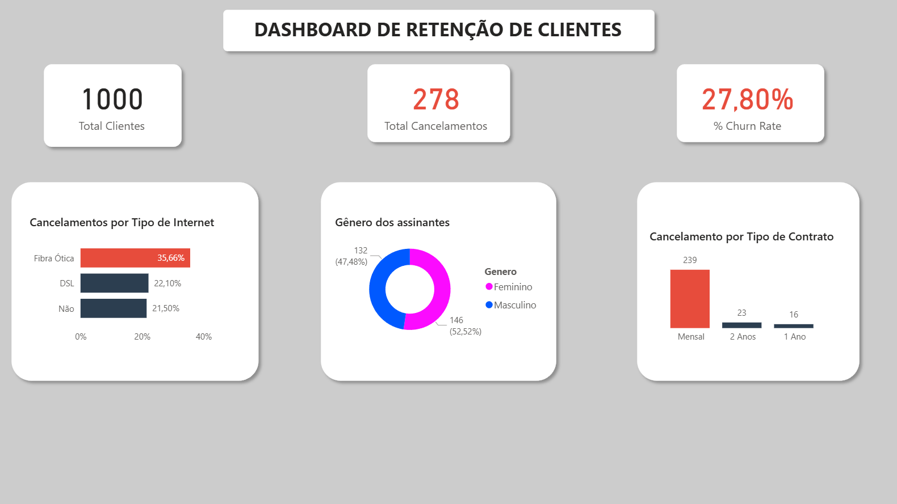

# 📊 Análise de Churn e Retenção de Clientes | Projeto Power BI

## 💼 Cenário de Negócio (FICTÍCIO)
A **TechConnect Telecom** (empresa fictícia) enfrentou um desafio crítico: o aumento na taxa de cancelamento de clientes (Churn). A diretoria precisava entender *quem* estava saindo e *por que*, para que o time de marketing pudesse criar estratégias de retenção preventivas.

**Meu Papel:** Como Analista de Dados, fui encarregado de construir um dashboard interativo para revelar padrões de comportamento e calcular o impacto financeiro desses cancelamentos.

---

## 🛠️ Tecnologias Utilizadas
* **Microsoft Power BI** (ETL, Modelagem e Visualização)
* **Power Query** (Limpeza e Tratamento de Dados)
* **DAX** (Cálculos Avançados e Medidas de Inteligência de Tempo)
* **Python** (Geração de massa de dados simulada para o estudo)
* **Figma** (Prototipagem do Background e Layout)

---

## 🔍 Principais Insights Descobertos
Analisando a base de dados de 1.000 clientes, identifica-se padrões críticos para a tomada de decisão:

1.  **Risco no Tipo de Contrato:** Clientes com **Contratos Mensais** têm uma chance **8x maior de cancelar** comparado aos de contratos anuais.
    * *Recomendação:* Criar campanha de migração oferecendo 10% de desconto para quem fechar o plano anual.
2.  **Problema na Fibra Ótica:** O serviço de **Fibra Ótica** apresenta a maior taxa de evasão, apesar de ser o produto premium.
    * *Recomendação:* Investigar instabilidade técnica na rede ou competitividade de preço na região.
3.  **O "Vale da Morte" (3 Meses):** A maioria dos cancelamentos ocorre nos primeiros 90 dias de contrato.
    * *Recomendação:* Implementar um Onboarding (boas-vindas) mais agressivo e acompanhamento próximo no primeiro trimestre.

---

## 📈 Funcionalidades do Dashboard
* **Cartões de KPI:** Monitoramento em tempo real de Total de Clientes, Taxa de Churn (%) e Receita em Risco.
* **Filtros Interativos:** Segmentação por Gênero, Tipo de Contrato e Método de Pagamento.
* **Storytelling Visual:** Uso estratégico de cores (Vermelho para alertas de cancelamento) para guiar o olhar do gestor.

---

## 🚀 Como Executar o Projeto
1.  **Download:** Baixe o arquivo `.pbix` neste repositório.
2.  **Abrir:** Utilize o Microsoft Power BI Desktop para abrir e interagir com os dados.
3.  **Dados:** O arquivo CSV original também está disponível na pasta para conferência.

---
*Desenvolvido por Wagner Lima* | [Conecte-se comigo no LinkedIn](https://www.linkedin.com/in/wagner-matos-de-lima/)
